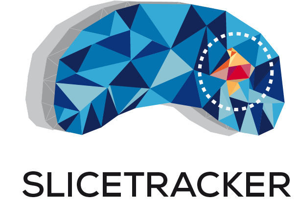

### Intro

SliceTracker is a 3D Slicer (see http://slicer.org) module that facilitates registration of pre- and intraprocedural MR prostate volumes. 

### Functionality

The module guides the user through a workflow that consists of the following steps:

* **1. Select incoming DICOM-series**
  
  The user is supposed to start with choosing the patient ID. The modules expects that the patient is already loaded into       local slicer dicom database. Relevant patient information (ID, Name, Date of Birth, Date of Study) are shown above the        module for easy inspection. Once the patient is selected, the preprocedural directory should be chosen, containing the        diagnstoic pre-procedural scan, the label of the prostate gland and the targets (see section [*Data                           conventions*](https://github.com/PeterBehringer/Registration/blob/master/README.md#data-conventions) to learn about what      type of strucutre and formats are expected). The last step is selecting the intra-procedural directory where new DICOM        series are supposed to be detected and presented to the user if they are relevant to the procedure. The user can select the   series that is incoming and importing it to slicer using the *load and segment*-button. In case of arriving patient data      that does not correlate to the choosed patient, the software will warn the user. 

* **2. Create intra-procedural label**

  For minimizing the computation time that is required by deformable registration, the user can specify regions of interest of   the structure to be registred. Therefore, two different modes (quick mode, label mode) are provided. Once the label is        created, the user is supposed to proceed by clicking the registration tab. 
  
* **3. Perform B-Spline registration**

  By following previous steps of the workflow, the user only needs to check visually if the input parameters are set            correctly. Registration parameters have been optimized in previous studies [1] and are not configuratable by the end-user.    Registration is performed using rigid, affine and deformable B-Spline stages applied in sequence.                             [BRAINSFit](https://github.com/BRAINSia/BRAINSTools/tree/master/BRAINSFit) with ITKv4 is used as underlaying library. 
  
* **4. Visual evaluation of registration result**

  Showing the result of all three registration stages enables quick troubleshooting in a very comprehensible way. The user can   switch between the results and compare the registered pre-procedural image with the intra-procedural. There are four          different tools and different visualization modes provided to compare the resulting image volume and target. Furthermore, a   needle tip can be set to measure the distance between each registered target and the needle tip. 

### Data conventions and testing

For testing purposes, the module expects the following folder structure:
```
└── Resources
  └── Testing
      ├─── intraopDir
      ├─── preopDir
      │    ├── t2-label.nrrd
      │    ├── t2-N4.nrrd
      │    └── Targets.fcsv
      ├─── testData_1
      │    ├── xxx.dcm
      │    ├── ....
      │    └── xxx.dcm
      ├─── testData_2
      │    ├── xxx.dcm
      │    ├── ....
      │    └── xxx.dcm
      └─── testData_3
           ├── xxx.dcm
           ├── ....
           └── xxx.dcm
```

If you want to test the module, please follow these steps:

* 0. make sure to install [VolumeClip](https://www.slicer.org/slicerWiki/index.php/Documentation/Nightly/Extensions/VolumeClip) from the slicer extension manager. (view -> Extension Manager)
* 1. create a folder structure as above, located in SliceTracker/Resources/
* 2. copy your pre-op data into the preopDir directory, containing (t2-label.nrrd, t2-N4.nrrd and Targets.fcsv). Note              that the preop data is expected not only to be in the same data structure but also to have the exact same names. 
* 3. copy your .dcm test data into the three folders (testData_1, testData_2, testData_3). Three orange simulations-buttons        can then be used to copy the files of the corresponding folders into the intraop folder to simulate DICOM data income. 
* 4. open slicer, search for SliceTracker, test it!

ATTENTION: for testing purposes, every file in intraopDir is deleted with every restart of the module!

### Contact

Please feel free to contact Peter Behringer peterbehringer@gmx.de for further feedback, suggestions, bugs.. 

### Literature

[1] Fedorov A, Tuncali K, Fennessy FM, et al. Image Registration for Targeted MRI-guided Transperineal Prostate Biopsy. Journal of magnetic resonance imaging : JMRI. 2012;36(4):987-992. doi:10.1002/jmri.23688.
